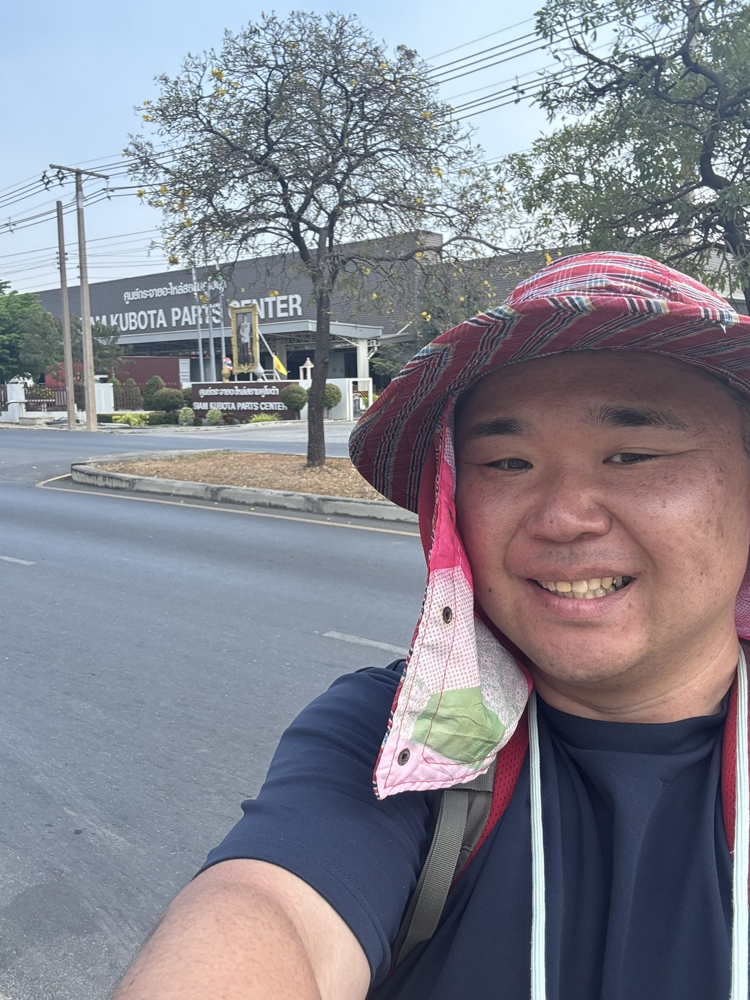

```{r setup, include=FALSE}
knitr::opts_chunk$set(echo = FALSE)
```


```{=html}
<!-- ちいさな追加スタイル（self-containedで埋め込み） -->
<style>
/* 見出しの余白と太さ */
h1, h2, h3 { letter-spacing: .02em; }
.section-lead { font-size: 1.1rem; opacity:.9; }

/* カードの見た目 */
.card { border: 0; border-radius: 1rem; }
.card:hover { transform: translateY(-2px); transition: .2s ease-in-out; }
.card .card-body { padding: 1.25rem 1.25rem; }

/* ヒーロー帯の上で文字の視認性を少し上げる */
.quarto-title-block .quarto-title-banner {
  background-position: center; background-size: cover;
}
.quarto-title .title, .quarto-title .subtitle {
  text-shadow: 0 1px 12px rgba(0,0,0,.25);
}

/* セクションの上下余白 */
section { scroll-margin-top: 80px; }
.section-pad { padding: 2rem 0; }
@media (min-width: 992px) {
  .section-pad { padding: 3.5rem 0; }
}

/* フッター */
.site-footer { font-size: .95rem; opacity: .85; }
</style>
```

# 👋 概要

::: section-lead
宇都宮研究室は、<strong>インクルーシブ・モビリティ</strong>、<strong>衛星画像情報を用いた人的資源量推定</strong>、<strong>社会‐生態システム</strong>を横断する研究に取り組んでいます。
:::

<!-- ::::::: section-pad -->
<!-- :::::: {.row .g-3} -->
<!-- ::: {.col-12 .col-md-4} -->
<!-- ```          -->
<!-- <div class="card h-100 shadow-sm"> -->
<!--   <div class="card-body"> -->
<!--     <h3 class="h5 mb-2">研究の柱</h3> -->
<!--     <p class="mb-3">歩行者・車椅子ユーザの移動、空間自己相関を考慮したベイズ推定、東南アジアを中心とした食文化とリスク行動など。</p> -->
<!--     <a class="btn btn-primary btn-sm" href="#research">詳しく見る</a> -->
<!--   </div> -->
<!-- </div> -->
<!-- ``` -->
<!-- ::: -->

<!-- ::: {.col-12 .col-md-4} -->
<!-- ```          -->
<!-- <div class="card h-100 shadow-sm"> -->
<!--   <div class="card-body"> -->
<!--     <h3 class="h5 mb-2">論文・データ</h3> -->
<!--     <p class="mb-3">査読論文、プレプリント、再現可能なコード・データ公開のリンク集。</p> -->
<!--     <a class="btn btn-primary btn-sm" href="#publications">一覧へ</a> -->
<!--   </div> -->
<!-- </div> -->
<!-- ``` -->
<!-- ::: -->

<!-- ::: {.col-12 .col-md-4} -->
<!-- ```          -->
<!-- <div class="card h-100 shadow-sm"> -->
<!--   <div class="card-body"> -->
<!--     <h3 class="h5 mb-2">参加・見学</h3> -->
<!--     <p class="mb-3">セミナー・ジャーナルクラブ、研究室見学、共同研究のご案内。</p> -->
<!--     <a class="btn btn-primary btn-sm" href="#join">参加方法</a> -->
<!--   </div> -->
<!-- </div> -->
<!-- ``` -->
<!-- ::: -->
<!-- :::::: -->
<!-- ::::::: -->

## 📰 お知らせ {#news}

-   2025-09-12　新サイト試験公開。レイアウトのフィードバック歓迎です。
<!-- -   2025-08-20 データセット <em>Inclusive Mobility in Chiang Mai</em> を公開。 -->
<!-- -   2025-07-28 学会発表スライドを更新。 -->

## 学術業績

[Researchmap](https://researchmap.jp/yuzuruu)参照。

## ゼミナール案内

[宇都宮研究室へようこそ](seminar/introduction_to_yuzurulab.html)


## 🔬 研究トピック {#research}

研究室の最近の主題は次の3つです。

+ 造船業における作業と熟練その他いろいろ ：若くないとできなかった研究。若かったワタクシを受け入れてくださった方々に記して謝意を表します。
+ 衛星情報を用いた人的資源量推定：人的資源は、ある地域に分布する働けそうな人々の数。たのしい統計的推論とたのしい現地調査@タイとを組み合わせるたのしい研究。35,000歩/日歩く。暑い。2kg/日痩せます。調査が終わればリバウンド。ห้องน้ำอยู่ที่ไหนครับ。
+ ベトナムおよびカンボジアにおける生態系サービス推定：水産学部と環境科学部と共同研究。淡水フグはおいしいよ。
    - その他色々：車椅子にGPSとカメラを取り付けて、車椅子観光客を阻むものはなにで、どう移動に影響するか解明してます。意外な結果を得て、これはまたびっくり。

::: callout-tip
**方法論の特徴**：RとStan（cmdstanr）による階層ベイズ、空間ラグ／誤差の実装など統計学的知見と、地べたを這って集めたデータを組み合わせるのです（@fig-navanakorn）。
:::

```{r navanakorn, echo=FALSE, fig.align = "center", out.width='20%'}
#| label: fig-navanakorn
#| fig-cap: "2025年2月ナワナコン工業団地にて。ひたすら歩き回って35,000歩。今日も元気だお水がうまい。"

```

## 📚 論文・データ・コード {#publications}

[researchmap](https://researchmap.jp/yuzuruu)
[Github](https://github.com/yuzuruu)


## 👥 メンバー {#people}

-   教員：宇都宮 譲（Ph.D.）\
-   学生・協力研究者：

## 🧭 参加・見学 {#join}

-   ジャーナルクラブ（労務管理・HRM）：月1回／オンライン併用\
-   データ演習（R / Quarto / Stan）：不定期\
-   見学・共同研究の相談はメールにてご連絡ください。

## 📍 アクセス {#access}

長崎大学経済学部\
4-2-1 Katafuchi, Nagasaki, Japan\
E-mail: [yuzuru@nagasaki-u.ac.jp]{#contact}


## 予定

<style>
  .calendar-embed { width:100%; height:85vh; border:0; }
  @media (max-width: 768px){ .calendar-embed{ height:70vh; } }
</style>
<div class="my-4">
  <iframe class="calendar-embed" src="https://outlook.office365.com/owa/calendar/51896bf96d77433398ee15cc9b3fbef6@nagasaki-u.ac.jp/8659510011f748b58f1a5a84ecd768907175623422547927765/calendar.html" loading="lazy" referrerpolicy="no-referrer" title="Outlook Calendar"></iframe>
</div>


------------------------------------------------------------------------

::::: {.site-footer .d-flex .justify-content-between .align-items-center .py-3}
<div>

(c) 2025 Yuzurulab

</div>

:::::
