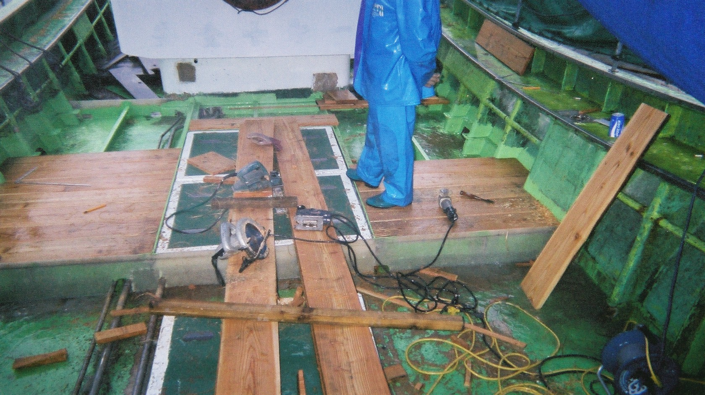
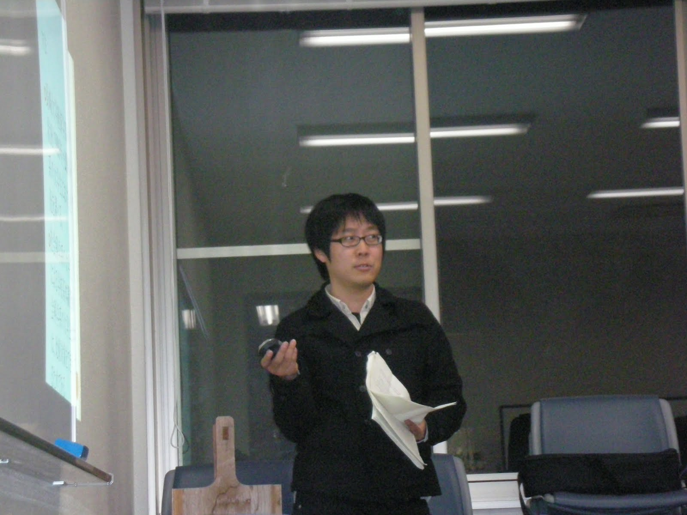

本文書は、宇都宮研究室を志願される方向け手引き書です。ご参考となれば幸いです。

## 教員紹介

+ 名前：宇都宮　譲
+ 曜日・時間：火曜日4-5限（応相談）
+ 教室：新館408室
+ 専門　人的資源管理
+ 電子メール　yuzuru@nagasaki-u.ac.jp

+ 研究
    - 造船業における作業と熟練その他いろいろ (@fig-itago)：若くないとできなかった研究。若かったワタクシを受け入れてくださった方々に記して謝意を表します。
    - 衛星情報を用いた人的資源量推定：人的資源は、ある地域に分布する働けそうな人々の数。たのしい統計的推論とたのしい現地調査@タイとを組み合わせるたのしい研究。35,000歩/日歩く。暑い。2kg/日痩せます。調査が終わればリバウンド。ห้องน้ำอยู่ที่ไหนครับ。
    - ベトナムおよびカンボジアにおける生態系サービス推定：水産学部と環境科学部と共同研究。淡水フグはおいしいよ。
    - その他色々：車椅子にGPSとカメラを取り付けて、車椅子観光客を阻むものはなにで、どう移動に影響するか解明してます。意外な結果を得て、これはまたびっくり。
+ 学術業績：[Researchmap](https://researchmap.jp/yuzuruu)参照。

{fig-align="center" width="100%"}

## 目的

:::callout-note
### このゼミで身につくこと
- 調査→要約→考察→**IMRAD**にて報告書や論文を書く能力。
- **Microsoft ExcelとR**で再現可能な統計分析スキル（学部＋α）。
- **納期までに仕上げる**実行力。
:::

　当研究室は、人的資源管理について学ぶことを通じて、諸君が人生を切り開く能力を開発すること、および人類社会に貢献できる人物になることを目指します。ついでに、学問や科学は楽しくまたおそるべきものであることを理解してくれるとありがたいです。

[研究室見学](visit.qmd) · [評価ルーブリック](rubric.qmd)

## 方法

いろいろなことに平行して取り組みます。1週間に取り組むことは、工場見学準備と文献講読、PCアプリケーション取扱です。

### スケジュール概要

ゼミナールは、90分/週です。進捗に応じて、多少長くなったり短くなったりします。以下は、教室以外にてどのくらい学修時間を要するか概算した値です。

+ 1ヶ月をどう過ごすか
    - 前半（必要な週内作業時間：3日✕2時間/日）：文献講読。A4表裏1枚程度にてハンドアウトを準備。ハンドアウト内容は、文献要旨と考察。関連する図表挿入するとなおよい。
    - 後半（必要な週内作業時間：3日✕2時間/日）：工場見学事前調査報告。文献講読同様にハンドアウトを準備すること。
    - [ハンドアウトフォーマット](handout_template.pdf)を用意済。質問状と見学時チェックリストも同様に準備します。
    - 月1回（必要な作業時間：10日✕1時間/日）：RとMicrosoft Excel使い方指南。

3年次における目標です。いろいろなことに、少しずつ慣熟しましょう。

+ 3年次をどう過ごすか
    - 4-5月　文献読みながら工場見学（その1）を準備・実施して慣れる。
    - 6-8月　文献読みながら工場見学（その2）を準備・実施して自律的に工場見学運営する。
    - 10-12月　文献読みながら工場見学（その3）を準備・実施しつつ、論文執筆に必要な技能を獲得する。
    - 1-2月　卒業論文に備える。

### 工場見学

大学にて学ぶ人的資源管理に関する概念と社会現象とを一対一対応させるために必要です。なんといっても、工場は経営学にとってふるさとです。

年3回程度実施予定。手順は以下に示す通りです。最初はなにをやらされているかわからないでしょうけれど、やっているうちにできるようになりますし、[意義を了解](https://www.youtube.com/watch?v=qVL8-VyE9Ok)できます。

1. 行先を決める：関心がある産業や職場を同定します。受け入れてくれない場合もありますから、複数案をつくるといいでしょう。
    + 参考　これまでに訪問した工場
        - [日本製鉄八幡製鉄所](https://www.nipponsteel.com/works/kyushu/yawata/about/index.html)
        - [日本製鉄大分製鉄所](https://www.nipponsteel.com/works/kyushu/oita/about/outline.html)
        - [日産九州](https://www.nissankyushu.co.jp/)
        - [杵の川酒造](https://www.kinokawa.co.jp/)
        - [TOTO小倉工場](https://jp.toto.com/company/profile/office/honsha/)
        - [LIXIL鹿島工場](https://www.lixil.co.jp/corporate/recruit/about/workplace/)
        - その他造船所や食品製造工場などなど。外国（タイ王国進出各社および現地企業）もありました。

2. テーマを決めて調査研究する：1つ/名、対象にまつわるテーマを決めます。実行可能性第一です。労働にまつわるものでなくても結構です。
    + 参考　これまでにあったテーマ
      - 衛生陶器メーカー占有率と占有率差異をもたらす要因：公衆トイレにて衛生陶器メーカをひたすら記録する。

関連するデータ（政府や業界団体が集めたデータ）や、先行研究（過去に実施された似たような研究）も集めます。方法論もここで磨くといいでしょう。

3. 質問状を作成・送付する：

　先方に送付します。見学2週間前には先方に到着するよう作成します。

4. 見学する：最大漏らさず記録しながら見学してください。印象もなにもかもメモしてください。

5. 質疑応答する：先方担当と丁々発止、質疑応答してください。時間が不足するくらいがちょうどいいです。ショートペーパーを書くために必要な情報を得る機会です。

6. ショートペーパーを書く：もっとも重要なプロセスです。仕様は以下に示す通りです。詳細は最上部テンプレートを参照してください。

  - 仕様
      - 納期：工場見学終了3週間以内
      - 分量：A4用紙5ページ以内
      - 形式：[IMRAD](https://www.editage.jp/insights/tips-for-writing-the-perfect-imrad-manuscript)
      - 提出先：研究室SNS（Microsoft Teams）
      - 特記事項
          - 提出前に要旨をゼミナールにて発表すること。
          - 図表を挿入することを推奨します。
          - 提出前に宇都宮に添削してもらうといいでしょう。

### 文献購読

大量にある知見を整理しながら、新たな観点を得るために実施します。網羅的に知識を獲得するためにも有用。

レポートや論文を書けないひとつの理由は、文献を読みこなす量が足りないからです。なにか書くには、日頃から読みまくらないといけません。

+ 読書に慣れる：4月と5月は、内容を整理して他人に理解してもらう作業に慣れましょう。いずれも1,000円/冊以内で読めます。
    - 『[生きづらい明治時代](https://www.iwanami.co.jp/book/b374925.html)』：通俗道徳（美徳とされる生活習慣）は社会変容中に人々の首を絞めてきたかをやさしく論じる名著。『[日本の近代化と民衆思想](https://www.heibonsha.co.jp/book/b160497.html)』もおすすめ。
    
    - 『[ものづくりに生きる](https://www.iwanami.co.jp/book/b269082.html)』：著者は旋盤工かつ作家。町工場を渡り歩いた熟練旋盤工による一代記。

    - 『[ゾウの時間ネズミの時間](https://www.chuko.co.jp/shinsho/1992/08/101087.html)』：生物読み物屈指のベストセラー。アロメトリーなど生物学理論にも言及する。経営学に同理論を応用できるかもしれない。

+ 人的資源管理にまつわる文献を講読する：6月以降、もう少し高度な文献に触れましょう。
    - [Skills of an effective administrator](https://d1wqtxts1xzle7.cloudfront.net/43136750/8-libre.pdf?1456602329=&response-content-disposition=inline%3B+filename%3DSkills_of_an_Effective_Administrator.pdf&Expires=1752138284&Signature=avURz-MDVVar1IecNGoZAg459cOPQnWgOX3JCLosWB55QpnxRAwkm8YPSrX03E40~S-DtuXFdHb17bSD-3Ag9ZNzatCfdjnoQK7ofL26SUpnml23dEPnq0nvLW8TzYhFPXaO8F5P14HAv9tElv42pLrYOceZauoXcw14hdRg2vMfEDw0QNXJ2FVaw5mEB7F7D2dT57YK~2eJzSYywT7Q~IU7puViBt~B1ND~xLiS6kLwHUfaZ2YJf3mRpprk9zaaBz81XT7a9fyNVvKj3zBY-wcEsN67cCYy-gc1N42DPas4lbwMmGWlU1Va7mQahojb~kUHU2qer7bHdMQ97JD2sA__&Key-Pair-Id=APKAJLOHF5GGSLRBV4ZA)：名作中の名作論文。管理者が保有することが望ましいとされる熟練を整理して提示する。たまには英語を読みましょう。慣れてきたら、ずっと英語論文を読みましょう。
    - [『なぜ日本企業は強みを捨てるのか』](https://www.nikkei.com/article/DGXKZO85707120V10C15A4NNK001/)：労働研究にて一家をなした大家による読み物。論調は名著『職場の労働組合と参加』の頃から変わらない。電子版。

あとは関心に応じて、都度決めましょう。

{fig-align="center" width="100%"}

### データ処理

データ（数字で表現できる現象）を眺めて、要約したり推論したりする能力を養います。好むと好まざるとにかかわらず、当世は必須な技能です。

Microsoft ExcelとRというソフトウェアを使います。Rは無料統計解析環境（ソフトウェア）です。各位必携PCからは、当方にて用意するRサーバにアクセスしていただければ結構です。必携PCにインストールしていただく必要はありません。内容は、学部で習う統計学$+ \alpha$くらいです。もちろん、もっとよく勉強したいという方にはお付き合いします。研究室が暖まるくらい計算機を回すと楽しいですよ。

### 卒業論文
本学所定様式にて執筆いただきます。テーマは労働にまつわるものを推奨します。スケジュールはおおよそ下記通りです。

+ 3年次1月-4年次4月　プロポーザル（研究計画書）作成・発表。プロポーザルには、研究目的と対象・方法、予想される結果と結論を書く。できれば、研究をする意義と独自性にも言及する。
+ 4年次5月　調査開始・文献購読。必要なデータを探すもしくは調査を実施する。質問票調査は倫理的に認められない。代わりに行政統計・二次データ・現地観察などで検証。文献はたえず探してたえず読む。
+ 4年次6-7月　データ収集・文献購読。文献も引き続き読む。
+ 4年次8-9月　データ処理・執筆。集めたデータを統計処理する。R大活躍。
+ 4年次10-11月　10月第2金曜日までに初稿提出・添削。提出期限を過ぎた場合、指導教員は卒業論文を評価しない権利を留保する。初稿で完成することはまずない。指導教員に添削してもらいながら、次第に完成を目指す。
+ 4年次12月　最終確認
+ 4年次1月上旬　印刷版を学務係に提出

3年次に懸賞論文を書いておくと、手順も理解されまた関心が収束しますから、都合がいいでしょう。

<!-- ### その他いろいろ -->
<!-- + 料理：経済学部構内にて鍋つくったり流し素麺やったりしました (@fig-soumen)。そういえば、陶器製作体験に出かけて、皿をつくったこともありました。 -->
<!-- + 研修旅行：長崎県内から九州内、首都圏、タイ王国に至るまで、以前はいろいろなところに出かけました。希望があれば、スタンプラリー形式にて、都市でも山奥でも歩けるようにしてさしあげます。職探しするとき、交通機関を選ぶことや似たようなオフィスビルが並ぶ中から目的地を見つけることは意外に大変です。 -->

<!-- {fig-align="center" width="100%"}
 -->

## 一問一答
::: {.panel-tabset}

### 欠席してもいいですか。
学生便覧所載規程に基づきます。やむを得ない事情は事前にMicrosoft Teamsで連絡してください。代替課題・補講等で学修機会を確保します。

諸君が学修する機会は、納税者が納めた貴重な血税によることを常に念頭において下さい。

### どのくらいお金かかりますか。
文献代金6,000円（最大）と工場見学交通費です。交通費は工夫して最小化しましょう。文献購入費を抑えるには、図書館やインターネットからアクセス可能な無料英語文献を講読することが有効です。

### 過去にどのような卒論を執筆した学生がいましたか。
いわゆるM字カーブをもたらす要因に関する研究とコンビニ労働に関する研究、海外進出企業におけるHRMに関する研究は白眉でした。福利厚生に関する研究もよかったです。ほかにもいろいろありました。

### 資格取得に意を用いますか。
別途に日を設けて勉強会をしましょう。
   
### 公務員希望者でも結構ですか。
結構です。ただし、いわゆるダブルスクールをされるときはご相談ください。本職は学業優先という立場です。

### 学生研究室はありますか。  
希望する学生が多いようでしたら、準備します。少ないようでしたら、本職研究室をご利用ください。おもな設備は、Rサーバ、冷蔵庫、ポット、ミーティングデスクです。冷蔵庫内にはたいていヨーグルトが入っています。暑い季節には、冷凍庫内におたのしみが入っているかもしれません。
   
### 懸賞論文などには応募しないといけませんか。  
推奨しますが義務とはしません。お小遣い稼ぎと論文執筆に慣れるためにおすすめです。2等賞金50千円です。
   
### ハンドアウトとはなんですか。  
レジュメとも呼ばれる報告資料です。A4用紙表裏1枚以内にて作成してもらいます。図表など挿入されると、さらによいでしょう。
   
### 人数多いですか。  
3・4年次合計10名を超えたことは20年間に2度しかありません。当研究室は常に少ない人数にて高密度な活動を実施します。
   
### 留学生いますか。  
Special seminarとして留学生も受講します。使用言語は日本語と英語です。英語を使っていただけると助かります。言語もさることながら、本邦社会に関する知見や認識がより重要と考えられます。
 
### 留学したいです。  
ご自由にどうぞ。交換留学がおすすめです。

### 集団作業ありますか。  
あんまりないです。一人ひとり腕を磨くことを重視します。人生は一人ひとりのものですから、一人ひとりが技能を磨き精確なる仕事をなすことは当然です。成り行きで集団作業することはあるでしょうし、集団作業をさまたげることはありません。
   
### ChatGPT使ってもいいですか。  
止めはしませんが、最初はなんでも自分でやってみることをおすすめします。技量が低いうちに生成AIに慣れると、なにもできなくなってしまうそうです。身体で覚えることは意外にたくさんあります。

### 英語上手になりますか。  
英語を読み書きできるようになれば、話すことは自然にできるようになります。生成AIに助けてもらいながら、英訳できそうな簡単な日本語にて草案を考えてから英語にてハンドアウトを作られるといいでしょう。語彙を増やしたいなら、TOEICスコアを800点以上まで上昇させることを目指しましょう。

### どのくらい勉強しないといけませんか。  
たくさん勉強してください。人生で勉強ばかりしていても怒られないのは、いまが最後です。仲間がいればいっしょにされてもいいでしょうし、仲間がいなくて寂しいならば[動画](https://www.youtube.com/watch?v=neGPcdV3vfk)が手伝ってくれます。

### 結局、人的資源管理ってなんですか。  
有限な労働力を無駄なく配分・活用する方法を追求する領域です。教育訓練や賃金構造決定など古典的な職務から、動機づけまでいろいろです。最近は動機づけに力を入れすぎな気がします。人的資源がどの程度分布するか推定する方法論も必要でしょう。

:::
   
